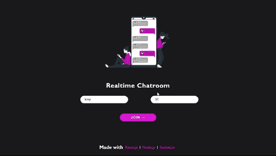

# 💬 Realtime Chatrooms

A fully responsive real-time chat application that allows users to connect and communicate seamlessly. Built with React.js, Node.js, and Socket.io, this app uses bidirectional communication powered by Socket.io to deliver a smooth and engaging chat experience.

## 🌐 Hosted App
**Live Demo**: [https://realtime-chatroomss.netlify.app](https://realtime-chatroomss.netlify.app)

---

## 🎥 Demo Video


---

## 🛠️ Tech Stack

### Front-End
- React.js

### Back-End
- Node.js
- Socket.io


---

## ✨ Features
- **Responsive Design**: Fully optimized for all screen sizes.
- **Realtime Chatting**: Instant message delivery with bidirectional communication.

---


## ⚙️ Installation and Setup
Follow these steps to run the project locally:

### Prerequisites
Ensure you have the following installed:
- **Node.js**: [Download Node.js](https://nodejs.org/)
- **npm**: Comes with Node.js installation

### Clone the Repository

```bash
git clone https://github.com/AshikurRahman3/chat-app.git
```
### Install Dependencies

**For the front-end:**

```bash
cd client
npm install
```

**For the back-end:**

```bash
cd server
npm install
```

handle the .env file in both client and server directory

### Run the Application

**Start the back-end server:**

```bash
cd server
npm start
```

**Start the front-end:**

**Open a new terminal and run:**

```bash
cd client
npm start
```


## 🚀 Deployment
- **Front-End**: Hosted on [Netlify](https://www.netlify.com)
- **Back-End**: Deployed on [Render](https://render.com)

---


## 🖋️ Author
- **Ashikur Rahman**  
  [GitHub](https://github.com/AshikurRahman3) | [LinkedIn](https://www.linkedin.com/in/ashikur-rahman-838a07206/)


